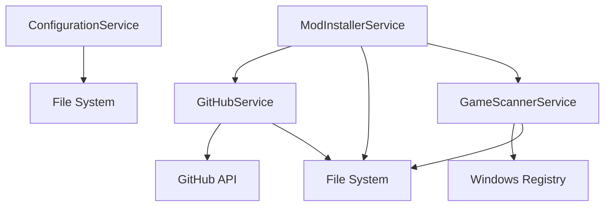

# 🏗️ OptiScaler Manager - Architecture Documentation

> **Version 0.0.1** - Core Services Implementation

## 📋 Table of Contents

- [Overview](#overview)
- [Architecture Pattern](#architecture-pattern)
- [Core Services](#core-services)
- [Data Models](#data-models)
- [Service Dependencies](#service-dependencies)
- [Platform Support](#platform-support)

---

## 🎯 Overview

OptiScaler Manager is built on a **clean, service-oriented architecture** using the MVVM pattern. The application is divided into three main layers:

```
┌─────────────────────────────────────────┐
│         OptiScaler.UI (WinUI 3)         │  ← Presentation Layer
│   Views, ViewModels, Custom Controls   │
└──────────────────┬──────────────────────┘
                   │
┌──────────────────▼──────────────────────┐
│        OptiScaler.Core (Business)       │  ← Business Logic Layer
│   Services, Models, Contracts          │
└──────────────────┬──────────────────────┘
                   │
┌──────────────────▼──────────────────────┐
│         External Dependencies           │  ← Infrastructure Layer
│   File System, GitHub API, Registry    │
└─────────────────────────────────────────┘
```

---

## 🎨 Architecture Pattern

### **MVVM (Model-View-ViewModel)**

```
View (XAML)
    ↕ Data Binding
ViewModel (C# Class)
    ↕ Commands & Properties
Model (Data + Services)
```

**Benefits:**
- ✅ Clean separation of UI and business logic
- ✅ Testable code without UI dependencies
- ✅ Easy to maintain and extend
- ✅ Supports two-way data binding

---

## 🔧 Core Services

### **1. GameScannerService**

**Purpose:** Detect installed games across multiple gaming platforms

**Supported Platforms:**
- 🎮 Steam
- 🎯 Epic Games
- 🎮 Xbox Game Pass / Microsoft Store
- 🎯 GOG Galaxy
- 🎮 EA App / Origin
- 🎯 Ubisoft Connect

**Key Methods:**
```csharp
Task<IEnumerable<GameInfo>> ScanAllPlatformsAsync(CancellationToken)
Task<IEnumerable<GameInfo>> ScanPlatformAsync(GamePlatform, CancellationToken)
Task<GameInfo?> VerifyGamePathAsync(string gamePath)
Task<GameInfo> RefreshModStatusAsync(GameInfo game)
```

**Events:**
- `GameDiscovered` - Fired when a game is found
- `ScanProgress` - Reports scanning progress

**Implementation Details:**
- Uses Windows Registry for Steam, GOG detection
- Parses Epic Games manifest files (JSON)
- Scans WindowsApps folder for Xbox games
- Recursively searches common game directories
- Detects installed mods via file existence checks

---

### **2. GitHubService**

**Purpose:** Download mod releases from GitHub repositories

**Key Features:**
- 📥 Fetch latest releases via GitHub API
- 📊 Download progress tracking
- 🔄 Automatic retry on failures
- 📦 Support for multiple file formats

**Key Methods:**
```csharp
Task<GitHubRelease?> GetLatestReleaseAsync(string owner, string repo)
Task<IEnumerable<GitHubRelease>> GetReleasesAsync(string owner, string repo)
Task<string> DownloadAssetAsync(GitHubAsset asset, string destinationPath)
Task<(string, GitHubRelease)?> DownloadLatestModAsync(ModType modType)
```

**Events:**
- `DownloadProgress` - Reports download progress with speed

**Default Repositories:**
```csharp
OptiScaler       → cdozdil/OptiScaler
DlssgToFsr3      → Nukem9/dlssg-to-fsr3
```

**API Usage:**
- Uses GitHub REST API v3
- No authentication required (public repos)
- Rate limited to 60 requests/hour (unauthenticated)

---

### **3. ModInstallerService**

**Purpose:** Install, update, and manage game mods

**Key Features:**
- 📦 ZIP archive extraction
- 💾 Automatic backup before installation
- 🔄 Update existing mods
- 🗑️ Clean uninstallation with backup restoration
- ✅ Integrity verification

**Key Methods:**
```csharp
Task<ModOperationResult> InstallModAsync(GameInfo, ModType, string archivePath)
Task<ModOperationResult> UninstallModAsync(GameInfo, ModType)
Task<ModOperationResult> UpdateModAsync(GameInfo, ModType)
Task<IEnumerable<ModInfo>> GetInstalledModsAsync(GameInfo game)
Task<string> CreateBackupAsync(GameInfo game)
Task<ModOperationResult> RestoreBackupAsync(GameInfo, string backupPath)
```

**Events:**
- `InstallProgress` - Reports installation progress

**Mod Detection Patterns:**
```csharp
OptiScaler:
  - nvngx.dll
  - libxess.dll
  - amd_fidelityfx_vk.dll
  - nvngx.ini

DlssgToFsr3:
  - dlssg_to_fsr3.dll
  - nvngx_dlssg.dll
  - dlssg_to_fsr3.ini
```

**Backup Strategy:**
```
%LocalAppData%/OptiScaler Manager/Backups/
    ├── GameName/
    │   ├── 20241118_143022/    ← Timestamped backups
    │   │   ├── nvngx.dll
    │   │   └── ...
    │   └── 20241118_150530/
    └── ...
```

---

### **4. ConfigurationService**

**Purpose:** Manage application settings and user preferences

**Key Features:**
- 💾 JSON-based configuration storage
- 🔄 Real-time configuration updates
- 📤 Import/Export settings
- ⚙️ Type-safe value access

**Key Methods:**
```csharp
AppConfiguration GetConfiguration()
Task<bool> SaveConfigurationAsync(AppConfiguration config)
Task<AppConfiguration> ResetToDefaultsAsync()
T GetValue<T>(string key, T defaultValue)
Task<bool> SetValueAsync<T>(string key, T value)
```

**Events:**
- `ConfigurationChanged` - Fired when settings change

**Storage Location:**
```
%LocalAppData%/OptiScaler Manager/config.json
```

**Configuration Schema:**
```json
{
  "CustomGamePaths": [],
  "ExcludedPlatforms": [],
  "CheckForUpdatesOnStartup": true,
  "CreateBackupsBeforeInstall": true,
  "MaxBackupsPerGame": 5,
  "Theme": "Purple",
  "MinimizeToTray": true,
  "ShowNotifications": true,
  "DownloadPath": "%LocalAppData%/OptiScaler Manager/Downloads",
  "BackupPath": "%LocalAppData%/OptiScaler Manager/Backups",
  "PreferredModType": "OptiScaler",
  "Language": "en-US"
}
```

---

## 📊 Data Models

### **GameInfo**
```csharp
public class GameInfo : INotifyPropertyChanged
{
    string Name              // Display name
    string Path              // Installation directory
    string Executable        // Main .exe file
    GamePlatform Platform    // Steam, Epic, etc.
    bool HasOptiScaler       // OptiScaler installed?
    bool HasDlssgToFsr3      // DLSSG mod installed?
    DateTime LastScanned     // Last scan timestamp
    string Id                // Unique identifier
}
```

### **ModInfo**
```csharp
public class ModInfo
{
    ModType Type                  // OptiScaler, DlssgToFsr3
    string Name                   // Display name
    Version? InstalledVersion     // Current version
    Version? LatestVersion        // Available version
    bool IsInstalled              // Installation status
    bool UpdateAvailable          // Update check
    string Repository             // GitHub repo
    List<string> DllFiles         // Installed files
    DateTime? InstallDate         // When installed
}
```

### **GitHubRelease**
```csharp
public class GitHubRelease
{
    long Id                       // GitHub release ID
    string TagName                // Version tag
    string Name                   // Release name
    string Body                   // Release notes
    DateTime PublishedAt          // Publish date
    List<GitHubAsset> Assets      // Downloadable files
    Version? Version              // Parsed version
}
```

### **AppConfiguration**
```csharp
public class AppConfiguration
{
    List<string> CustomGamePaths
    List<GamePlatform> ExcludedPlatforms
    bool CheckForUpdatesOnStartup
    bool CreateBackupsBeforeInstall
    int MaxBackupsPerGame
    AppTheme Theme
    bool MinimizeToTray
    string DownloadPath
    string BackupPath
    ModType PreferredModType
}
```

---

## 🔗 Service Dependencies



**Dependency Injection (Future):**
```csharp
services.AddSingleton<IConfigurationService, ConfigurationService>();
services.AddSingleton<IGitHubService, GitHubService>();
services.AddTransient<IGameScannerService, GameScannerService>();
services.AddTransient<IModInstallerService, ModInstallerService>();
```

---

## 🖥️ Platform Support

### **Windows-Only APIs**

The following services use Windows-specific APIs and are annotated with `[SupportedOSPlatform("windows")]`:

**GameScannerService:**
- `ScanAllPlatformsAsync` - Uses Windows Registry
- `ScanPlatformAsync` - Platform detection
- `ScanSteamAsync` - Registry access
- `ScanGOGAsync` - Registry access
- `GetSteamInstallPath` - Registry access

**Why Windows-Only?**
- Registry API is Windows-exclusive
- Gaming platforms primarily target Windows
- WinUI 3 requires Windows 10 1903+

**Cross-Platform Considerations:**
For future cross-platform support:
1. Abstract registry access behind interfaces
2. Implement platform-specific scanners
3. Use conditional compilation
4. Fallback to file-based detection

---

## 📈 Performance Considerations

### **Asynchronous Operations**
All I/O operations use `async/await`:
- ✅ Non-blocking UI
- ✅ Cancellation support via `CancellationToken`
- ✅ Progress reporting through events

### **Memory Management**
- Uses `IDisposable` for unmanaged resources
- Cleans up temporary files after operations
- Streams large downloads instead of loading into memory

### **Caching Strategy (Future)**
```csharp
// Cache game list to avoid re-scanning
private static List<GameInfo>? _cachedGames;
private static DateTime _lastScanTime;

// Cache GitHub releases for 15 minutes
private static Dictionary<string, GitHubRelease> _releaseCache;
```

---

## 🧪 Testing Strategy

### **Unit Tests (Planned)**
```csharp
GameScannerServiceTests
├── ScanSteamAsync_ValidPath_ReturnsGames()
├── ScanSteamAsync_InvalidPath_ReturnsEmpty()
├── RefreshModStatusAsync_WithMods_DetectsCorrectly()
└── VerifyGamePath_ValidPath_ReturnsGameInfo()

GitHubServiceTests
├── GetLatestReleaseAsync_ValidRepo_ReturnsRelease()
├── DownloadAssetAsync_ValidUrl_DownloadsFile()
└── DownloadAssetAsync_InvalidUrl_ThrowsException()

ModInstallerServiceTests
├── InstallModAsync_ValidArchive_InstallsSuccessfully()
├── UninstallModAsync_InstalledMod_RemovesFiles()
├── CreateBackupAsync_ValidGame_CreatesBackup()
└── UpdateModAsync_NewerVersion_UpdatesSuccessfully()
```

### **Integration Tests (Planned)**
```csharp
├── ScanToInstall_FullWorkflow_Succeeds()
├── InstallUpdateUninstall_Cycle_WorksCorrectly()
└── BackupRestore_Cycle_RestoresOriginalState()
```

---

## 🔮 Future Enhancements

### **v0.2.0 - Advanced Features**
- 🔍 Fuzzy game name matching
- 📊 Installation analytics
- 🌐 Multi-language support
- 🎨 Custom mod configurations

### **v0.3.0 - Xbox Game Bar**
- 🎮 Overlay interface (Win+G)
- ⚡ Quick toggle mods
- 📈 Performance metrics
- 🎯 Per-game profiles

### **v0.4.0 - Cloud Integration**
- ☁️ Cloud settings sync
- 📤 Backup to OneDrive
- 🔄 Multi-device support

---

## 📚 Additional Resources

- [WinUI 3 Documentation](https://learn.microsoft.com/windows/apps/winui/)
- [.NET 8 Documentation](https://learn.microsoft.com/dotnet/core/whats-new/dotnet-8)
- [GitHub REST API](https://docs.github.com/rest)
- [MVVM Pattern Guide](https://learn.microsoft.com/windows/communitytoolkit/mvvm/introduction)

---

**📅 Last Updated:** November 18, 2024  
**👨‍💻 Author:** Jorge Coronas (Bigflood92)  
**🔖 Version:** 0.0.1
